# render_engine_v2

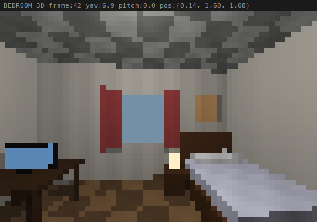

**ASCII buffer from live keystroke session:**

```
[ASCII buffer will be inserted here by CI workflow]
```

> Screenshot and ASCII buffer above are generated by CI from a live keystroke
> session driven via `POST /input`. Each character cell = 2 vertically-stacked
> pixels via Unicode half-block `U+2580` (▀). The SVG is rebuilt and committed
> on every push to `main`.

Real-time ray-traced 3D renderer that runs entirely in a terminal window.
No GPU. No graphics driver. No window manager. Just an ANSI-capable shell and Python.

Each character cell encodes two stacked pixels — foreground is the top pixel
(24-bit RGB via `ESC[38;2;R;G;Bm`), background is the bottom pixel
(`ESC[48;2;R;G;Bm`). A 60x20 cell grid becomes a **60x40 effective pixel
surface** at zero extra cost.

---

## Gallery

All SVGs are rendered headlessly by `gen_gallery.py` — no running renderer
required. Each image is a direct pixel-accurate export of the ray tracer's
output at the listed camera pose.

| View | Description |
|------|-------------|
| 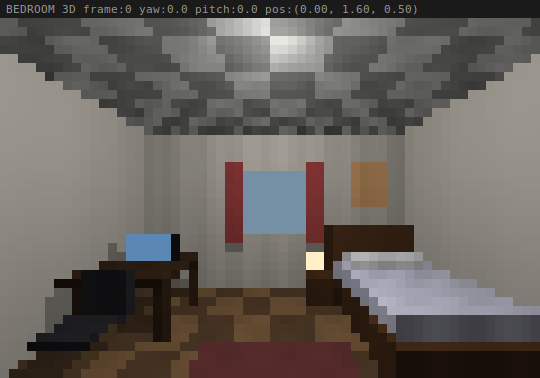 | **Default starting view** `yaw +0 pitch +0 pos (0.0, 1.6, 0.5)` |
| 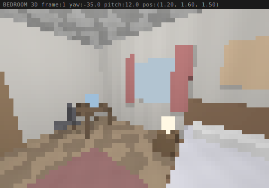 | **Close-up of the bed** `yaw -35 pitch +12 pos (1.2, 1.6, 1.5)` |
| 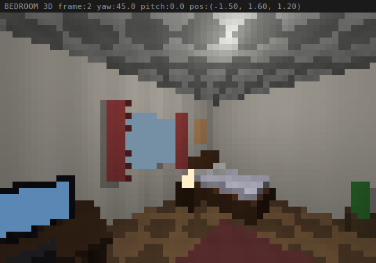 | **Desk and window area** `yaw +45 pitch +0 pos (-1.5, 1.6, 1.2)` |
| 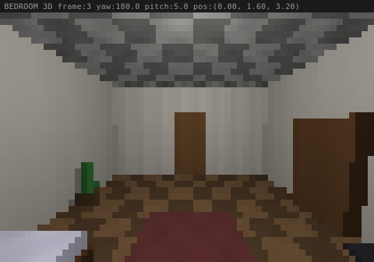 | **From the doorway looking into the room** `yaw +180 pitch +5 pos (0.0, 1.6, 3.2)` |
| 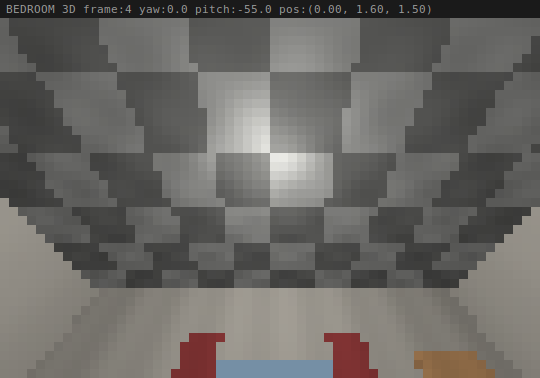 | **Looking up at the ceiling** `yaw +0 pitch -55 pos (0.0, 1.6, 1.5)` |
| 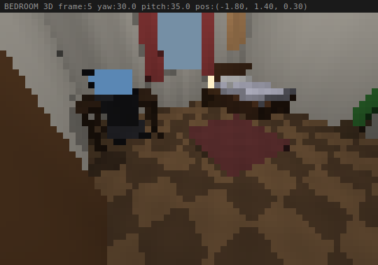 | **Low-angle corner shot** `yaw +30 pitch +35 pos (-1.8, 1.4, 0.3)` |
| 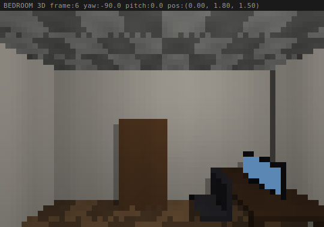 | **Wide sweep - side wall** `yaw -90 pitch +0 pos (0.0, 1.8, 1.5)` |

---

## Environments Gallery

Six distinct worlds, each rendered through the same ray-trace pipeline by
`gen_multi_gallery.py`.  The multi-environment system runs at 160x80 internal
pixels via `FramePipeline` + quadrant blocks — double the density of the
bedroom renderer.  All SVGs are generated headlessly: no running process, no
platform keyboard imports.

### Bedroom

| View | Description |
|------|-------------|
| 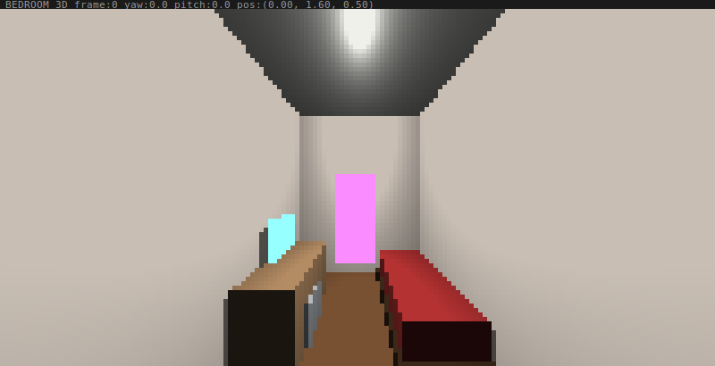 | **Entrance** `yaw +0 pitch +0 pos (0.0, 1.6, 0.5)` |
| 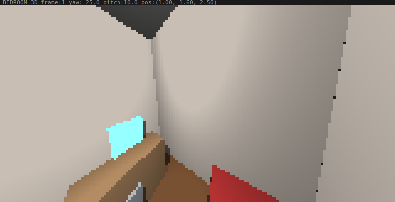 | **Across the bed** `yaw -25 pitch +10 pos (1.0, 1.6, 2.5)` |

### Office

| View | Description |
|------|-------------|
| 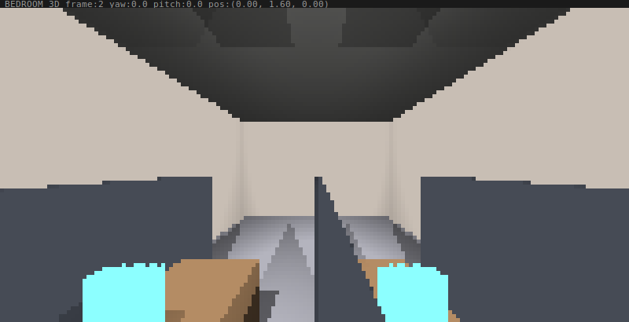 | **Open floor** `yaw +0 pitch +0 pos (0.0, 1.6, 0.0)` |
| 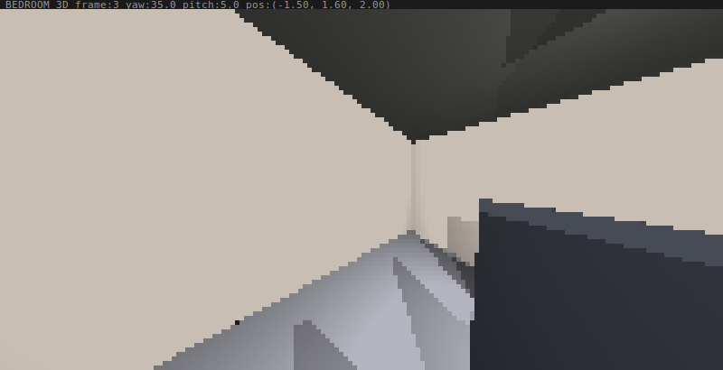 | **Cubicle corner** `yaw +35 pitch +5 pos (-1.5, 1.6, 2.0)` |

### Corridor

| View | Description |
|------|-------------|
| 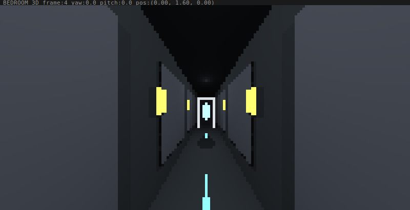 | **Hallway centre** `yaw +0 pitch +0 pos (0.0, 1.6, 0.0)` |
| 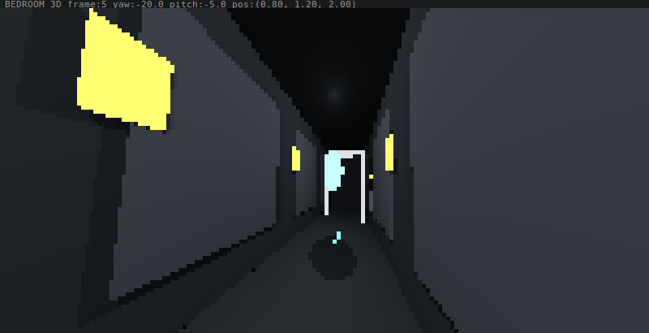 | **Glowing panel** `yaw -20 pitch -5 pos (0.8, 1.2, 2.0)` |

### Park

| View | Description |
|------|-------------|
| 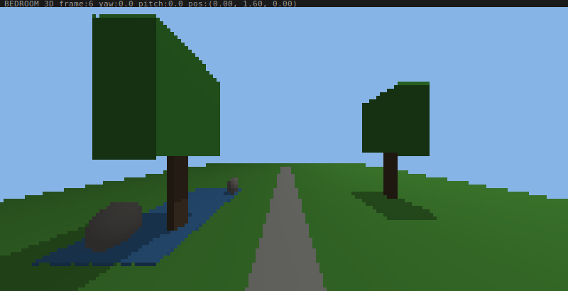 | **Open-air overview** `yaw +0 pitch +0 pos (0.0, 1.6, 0.0)` |
| 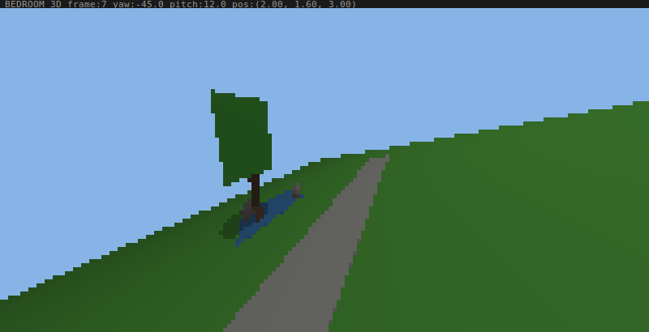 | **Pond edge** `yaw -45 pitch +12 pos (2.0, 1.6, 3.0)` |

### Dungeon

| View | Description |
|------|-------------|
| 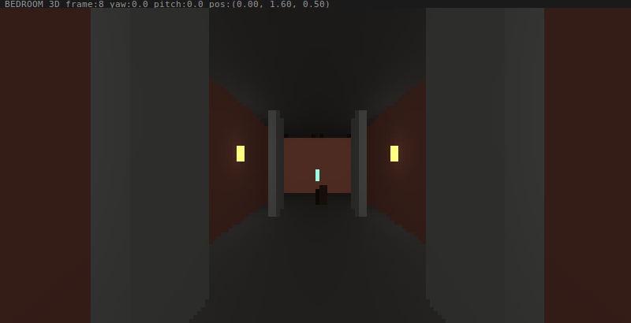 | **Torchlit entry** `yaw +0 pitch +0 pos (0.0, 1.6, 0.5)` |
| 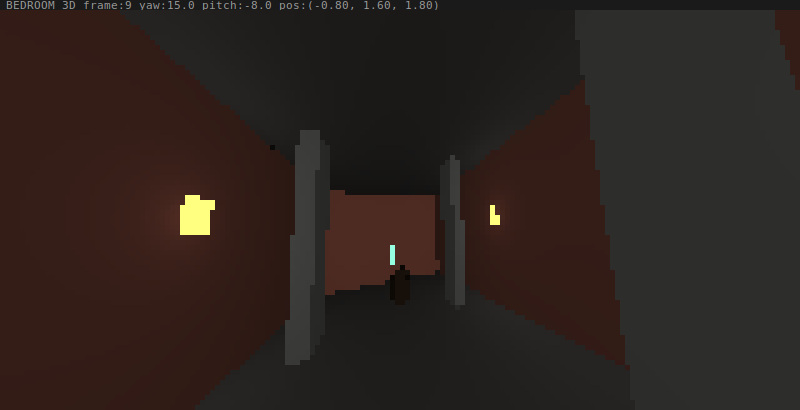 | **Torch from below** `yaw +15 pitch -8 pos (-0.8, 1.6, 1.8)` |

### Abstract

| View | Description |
|------|-------------|
| 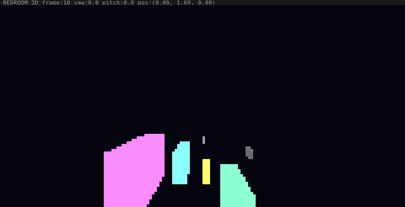 | **Centre void** `yaw +0 pitch +0 pos (0.0, 1.6, 0.0)` |
| 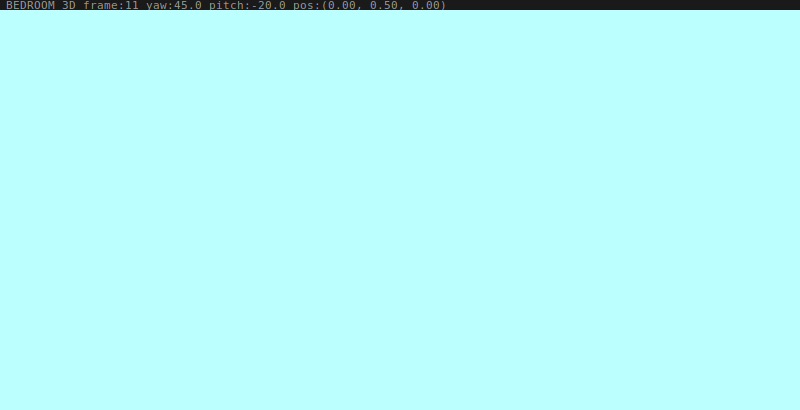 | **Low angle** `yaw +45 pitch -20 pos (0.0, 0.5, 0.0)` |

---

## Features

- **Pure software ray tracer** — axis-aligned box (AABB) and sphere intersection, Phong
  shading, shadow rays, distance attenuation, procedural floor/ceiling checker
- **Half-block rendering** — doubles vertical resolution using half-block chars with 24-bit
  ANSI truecolor (`ESC[38;2;R;G;Bm` fg / `ESC[48;2;R;G;Bm` bg)
- **6 built-in scenes** — bedroom, office, sci-fi corridor, outdoor park, dungeon, abstract
- **Embedded HTTP debug server** — 10 REST endpoints (9 GET + 1 POST) expose full renderer
  state as JSON after every keystroke and every frame
- **Per-tile feature dump** — every distinct frame writes a directory tree of per-pixel
  material, category, color, and transition records
- **Frame-delta detection** — only changed poses produce disk writes; spurious duplicate
  frames are suppressed
- **Live watcher** — separate terminal process tails the HTTP server and prints a structured
  event stream
- **Headless harness** — single-frame render to text files for CI / automated verification
- **Agent-controllable** — `POST /input` queues keystrokes into the render loop without
  focus stealing or win32 injection
- **Optional MSAA** — 2-sample anti-aliasing toggle (M key)
- **Shadow toggle** — T key skips shadow rays for approximately 2x speedup
- **Standard library only** — no pip dependencies; runs on Python 3.8+

---

## Requirements

### Python
- **Python 3.8+** (3.10+ recommended) on all platforms.
- No third-party packages. Standard library only.

### Operating System Support

The current code (`test_bedroom_enhanced.py`) is **Windows-only as shipped** because it
uses `msvcrt` for non-blocking keyboard input and `ctypes.windll.kernel32` to enable
ANSI/UTF-8 in the console. The renderer, math, HTTP server, and output pipeline are
fully portable — only the input layer and the auto-ANSI-fix are Windows-specific.

| OS | Status | Notes |
|----|--------|-------|
| **Windows 10 (build 14393+)** | Supported | Works in cmd.exe, PowerShell, Windows Terminal, VS Code. ANSI auto-enabled at startup. |
| **Windows 11** | Supported | Identical to Windows 10. |
| **Windows Server 2016+** | Should work, untested | Same console API generation as Windows 10. |
| **Windows 8 / 8.1** | Not supported | `ENABLE_VIRTUAL_TERMINAL_PROCESSING` console flag does not exist; ANSI escapes will print as raw text. |
| **Windows 7** | Not supported as-is | Same as 8.1 — no native ANSI. Workaround: install [ConEmu](https://conemu.github.io) or [ANSICON](http://adoxa.altervista.org/ansicon/) to translate ANSI escapes, then run the renderer. UTF-8 half-blocks (`▀`) also need a CJK-capable raster font (Lucida Console works). |
| **Linux** | Not supported as-is | `msvcrt` import will fail on line 3. See "Linux/macOS Port" below for the small change needed. |
| **macOS** | Not supported as-is | Same as Linux. Apple Terminal and iTerm2 already speak UTF-8 + truecolor natively, so only the input layer needs replacing. |
| **WSL 1 / WSL 2** | Not supported | Linux subsystem; same `msvcrt` blocker as native Linux. |

### Terminal Support (Windows)

| Terminal | Status |
|----------|--------|
| Windows Terminal | Works |
| PowerShell 5+ (default Win10/11) | Works (auto-fixed by SetConsoleMode at startup) |
| cmd.exe (Win10/11) | Works (auto-fixed) |
| VS Code integrated terminal | Works |
| ConEmu | Works |
| PowerShell on Win 7/8 | Requires ANSICON or ConEmu wrapper |

### Linux/macOS Port

To run on Linux or macOS, replace the keyboard input layer. The minimal change:

```python
# Replace lines 1-9 in test_bedroom_enhanced.py with:
import time, sys, math, random
import os, json, threading, http.server, socketserver
import select, termios, tty

_old_term_settings = termios.tcgetattr(sys.stdin)
tty.setcbreak(sys.stdin.fileno())

# Then replace get_keyboard_input():
def get_keyboard_input():
    keys = []
    seen = set()
    while select.select([sys.stdin], [], [], 0)[0]:
        ch = sys.stdin.read(1)
        if ch == '\x1b':  # Arrow key (ESC[A/B/C/D)
            seq = sys.stdin.read(2)
            mapping = {'[A': 'UP', '[B': 'DOWN', '[D': 'LEFT', '[C': 'RIGHT'}
            k = mapping.get(seq)
            if k and k not in seen:
                seen.add(k); keys.append(k)
        elif ch and ch.lower() not in seen:
            seen.add(ch.lower()); keys.append(ch.lower())
    return keys

# At program exit, restore terminal:
# termios.tcsetattr(sys.stdin, termios.TCSADRAIN, _old_term_settings)
```

UTF-8 and truecolor work natively on every modern Linux/macOS terminal — no console mode
configuration needed. A cross-platform port is on the roadmap but not yet implemented.

---

## Setup & Installation

1. Open a terminal and navigate to the project directory:
   ```powershell
   cd C:\Users\<you>\Desktop\Virtual World\render_engine_v2
   ```

2. Verify Python is available:
   ```powershell
   python --version
   ```
   Should show `Python 3.8.x` or later.

3. No `pip install` step required. Ready to run.

---

## Quick Start

```powershell
# Run the interactive renderer
python render_engine_v2/test_bedroom_enhanced.py

# In a second terminal -- tail the live debug stream
python render_engine_v2/debug_watcher.py

# Headless single-frame dump (no window, outputs 3 text files)
python render_engine_v2/debug_dump.py

# Headless dump at a specific pose: yaw_deg pitch_deg px py pz
python render_engine_v2/debug_dump.py 45.0 -10.0 0.5 1.6 1.2
```

---

## CI / Automated Validation

A GitHub Actions workflow (`render-ci.yml`) runs on every push to `main`:

1. **Keystroke-driven validation** — `ci_harness.py` drives the renderer entirely via HTTP `/input` and `/state` endpoints
2. **Camera state assertions** — verifies that each keystroke produces the expected camera movement
3. **Geometry/color export** — validates tile grid, material categories, and per-pixel color data
4. **Format conversions** — CSV → JSON/XML for artifact storage
5. **Gallery generation** — headless rendering of all camera poses to SVG
6. **Commit-back** — screenshots are rebuilt and committed automatically (with `[skip ci]` to prevent loops)

### Validation Output Example

**Test Environment**: `windows-2022` runner, Python 3.10.11

```
[harness] starting renderer: D:\a\VirtualWorld\VirtualWorld\render_engine_v2\test_bedroom_enhanced.py
[harness] waiting for server on http://127.0.0.1:8765 ...
[harness] server is up (PID 5408)

[harness] step 00 BASELINE      (no keys, waiting for first frame)
[harness] step 01 TURN_RIGHT    POST keys=['l']
           assert yaw_deg changed: PASS (0.00 → 6.88)
[harness] step 02 TURN_RIGHT2   POST keys=['l']
           assert yaw_deg changed: PASS (6.88 → 13.75)
[harness] step 03 LOOK_UP       POST keys=['i']
           assert pitch_deg changed: PASS (0.00 → -4.58)
[harness] step 04 FORWARD       POST keys=['w']
           assert pos changed: PASS ({0, 1.6, 0.5} → {0.0475, 1.6, 0.6943})
[harness] step 05 FORWARD2      POST keys=['w']
           assert pos changed: PASS ({0.0475, 1.6, 0.6943} → {0.0951, 1.6, 0.8885})
[harness] step 06 FORWARD3      POST keys=['w']
           assert pos changed: PASS ({0.0951, 1.6, 0.8885} → {0.1426, 1.6, 1.0828})
[harness] step 07 TURN_LEFT     POST keys=['j']
           assert yaw_deg changed: PASS (13.75 → 6.88)
[harness] step 08 LOOK_DOWN     POST keys=['k']
           assert pitch_deg changed: PASS (-4.58 → 0.00)

[harness] requesting tile dump for final frame ...
[harness] validate colors.csv: PASS
[harness] validate tiles.json: PASS
[harness] validate meta.json: PASS
[harness] validate ascii_preview.txt: PASS
[harness] validate map_category.txt: PASS
[harness] validate colors.csv values (1200 rows): PASS
[harness] validate tiles.json structure (1200 tiles): PASS
[harness] converted colors.csv -> colors.json (1200 rows)
[harness] converted colors.csv -> colors.xml (1200 rows)

[harness] OVERALL: PASS
```

### Artifacts Generated

Each successful CI run produces:
- **Keystroke validation results** (`ci_results.json`) — assertion log + field changes
- **Metadata files** — `colors.csv`, `tiles.json`, `meta.json`, `map_category.txt`, `ascii_preview.txt`
- **Format conversions** — JSON and XML versions of color grid
- **Bedroom gallery** — 7 SVG screenshots at different camera poses (127–132 KB each)
- **Multi-environment gallery** — 12 SVG screenshots across 6 worlds (5–430 KB range)
- **Zip archive** — all outputs in a single downloadable artifact for debugging

---

## Controls

| Key | Action |
|-----|--------|
| `W` / `S` | Move forward / backward |
| `A` / `D` | Strafe left / right |
| `I` / `K` | Look up / down |
| `J` / `L` | Turn left / right |
| Arrow keys | Same as IJKL |
| `R` / `F` | Rise / crouch (vertical position) |
| `SPACE` or `/` | Toggle auto-rotate mode |
| `M` | Toggle MSAA (2x anti-aliasing) |
| `E` | Toggle edge detection overlay |
| `T` | Toggle shadows (off is ~2x faster) |
| `X` | Toggle debug overlay |
| `N` | Cycle to next scene (multi-environment mode) |
| `Q` | Quit |

> `SPACE` is aliased to `/` because some terminal automation tools strip whitespace-only
> sends before they reach the process.

---

## Camera Physics

| Constant | Value | Effect |
|----------|-------|--------|
| `TURN_SPEED` | 0.12 rad | ~6.9 degrees per J/L keypress |
| `PITCH_SPEED` | 0.08 rad | ~4.6 degrees per I/K keypress |
| `MOVE_SPEED` | 0.20 units | Distance per W/A/S/D keypress |
| `MAX_PITCH` | 1.20 rad | ~68.8 degrees max look up/down |

Movement uses sinusoidal projection:
```
pos.x += sin(yaw) * MOVE_SPEED   # forward
pos.z += cos(yaw) * MOVE_SPEED
```

---

## Debug HTTP Server

The renderer starts an HTTP server on `http://127.0.0.1:8765` at launch. Disable with the
`DBG_DISABLE=1` environment variable.

### GET Endpoints

| Endpoint | Returns |
|----------|---------|
| `/state` | Full renderer state JSON — frame, pos, yaw, pitch, fps, hit-id, depth, ascii preview |
| `/ascii` | Current frame ASCII brightness preview as plain text |
| `/events` | Merged event log — keystrokes and frame deltas, last 100/50 entries |
| `/frames` | Index of distinct frames — lightweight, no ASCII payload |
| `/frames/latest` | Most recent distinct frame with full ASCII preview |
| `/frames/{N}` | Nth distinct frame; negative indexing supported |
| `/frames/clear` | Clear the frame ring buffer |
| `/tiles` | Live in-memory per-tile grid (1200 records for 60x20, no disk I/O) |
| `/tiles/dump` | Force-write tile directory tree for the current frame |

### POST /input

Queue keystrokes into the render loop from any HTTP client:

```
POST /input
Content-Type: application/json

{ "keys": ["w", "w", "l"], "wait_frames": 2 }
```

Each key is drained one per `wait_frames` render iterations. Returns the current state
snapshot with `accepted_seq` and `queued` counts. No win32 focus stealing, no buffer
overflow — agent-safe by design.

### State Shape

```json
{
  "frame": 489,
  "phase": "frame",
  "fps": 5.4,
  "pos": [0.024, 1.6, 0.699],
  "yaw_deg": 6.875,
  "pitch_deg": -4.583,
  "center_hit_id": 10,
  "center_depth": 3.29,
  "ascii_preview": ["...60 chars per row...", "...20 rows total..."],
  "last_keys": ["w"],
  "key_seq": 3,
  "timestamp": 1777593065.6
}
```

`center_hit_id` is the material ID of the object under the crosshair. An agent can poll
`/state` after each `POST /input` to verify the expected object is visible without parsing
1200 tile records.

---

## Agent Control Example

```python
import urllib.request, json, time

def send_key(key, wait=2):
    body = json.dumps({"keys": [key], "wait_frames": wait}).encode()
    req = urllib.request.Request(
        "http://127.0.0.1:8765/input",
        data=body,
        headers={"Content-Type": "application/json"},
        method="POST"
    )
    with urllib.request.urlopen(req) as r:
        return json.loads(r.read())

def read_state():
    with urllib.request.urlopen("http://127.0.0.1:8765/state") as r:
        return json.loads(r.read())

# Walk forward three steps, then turn right
for _ in range(3):
    send_key("w")
    time.sleep(0.5)

send_key("l")
state = read_state()
print(f"Yaw: {state['yaw_deg']:.1f}  Hit: {state['center_hit_id']}")
```

---

## Per-Tile Feature Dump

Every distinct frame (changed pose or changed ASCII preview) writes a directory tree under
`_debug_tiles/`:

```
_debug_tiles/
  frame_00489/
    meta.json              camera pose, trigger keys, dimensions
    tiles.json             full 60x20 grid -- 1200 tile records
    map_category.txt       60x20 single-char material category map
    map_top_mat.txt        60x20 hex material ID map
    ascii_preview.txt      brightness preview
    colors.csv             x,y,top_r,top_g,top_b,bot_r,bot_g,bot_b
    by_category/
      walls/               _index.txt + xx_yy.json per tile
      floor/
      ceiling/
      bed/
      desk_setup/
      windows/
      lights/
      furniture/
      decor/
      doors/
    transitions/           tiles where top-half and bottom-half are different materials
      _index.txt
      xx_yy.json
  latest/                  mirror of the most recent frame (always current)
```

Example tile record (`frame_00489/by_category/bed/35_13.json`):

```json
{
  "x": 35, "y": 13,
  "top_mat_id": 3,  "top_name": "bed_frame",  "top_category": "bed",
  "bot_mat_id": 4,  "bot_name": "bed_sheet",  "bot_category": "bed",
  "top_color": [49, 31, 18],  "bot_color": [157, 157, 171],
  "top_hex": "#311f12",       "bot_hex": "#9d9dab",
  "transition": false,
  "ascii": "("
}
```

Dumps are throttled to delta frames only (approximately 2 distinct frames per second during
active input). Auto-dump can be disabled with `DBG_AUTODUMP=0`.

---

## Live Watcher

```powershell
# Print keystrokes and frame deltas
python render_engine_v2/debug_watcher.py

# Include ASCII brightness preview after each delta frame
python render_engine_v2/debug_watcher.py --ascii

# Custom host, port, poll interval
python render_engine_v2/debug_watcher.py --host 127.0.0.1 --port 8765 --interval 0.05
```

Output format:

```
[watcher] connected. tailing events + frame deltas...
[watcher] columns: TIME PHASE FRAME KEYS YAW PITCH FPS POS HIT DEPTH
--------------------------------------------------------------------------
14:23:01 keystroke f=  200 keys=l   Y  +6.9 P  +0.0 pos=(+0.00,+1.60,+0.50) hit=10 t=3.47
14:23:04 delta     f=  341 keys=i   Y  +6.9 P  -4.6 pos=(+0.00,+1.60,+0.50) hit=10 t=3.49
14:23:06 delta     f=  489 keys=w   Y  +6.9 P  -4.6 pos=(+0.02,+1.60,+0.70) hit=10 t=3.29
```

---

## Headless Verification

```powershell
# Render one frame at default pose, write debug files
python render_engine_v2/debug_dump.py

# Custom pose: yaw_deg pitch_deg px py pz
python render_engine_v2/debug_dump.py 45.0 -10.0 0.0 1.6 0.5
```

Output files:

| File | Contents |
|------|----------|
| `_debug_hits.txt` | 60x40 grid — per-pixel material IDs as hex chars, `.` = sky miss |
| `_debug_ascii.txt` | 60x20 brightness preview — 70-level density ramp, collapsed half-blocks |
| `_debug_color.txt` | 60x40 grid — per-pixel RRGGBB hex triplets |

Also prints to stdout: render time, pixels/second, hit-ID histogram (top 10), miss
percentage, center-pixel detail (hit ID, color, depth, ray direction).

---

## Headless Driver

```powershell
python render_engine_v2/driver.py
```

Runs a hardcoded 10-step camera action sequence (baseline, turn right, look up, 3x forward,
3x turn left, forward) and prints a grounded state snapshot after each step — position, yaw,
pitch, center-ray hit, ASCII preview, and material category map. No HTTP server, no terminal
window. Used to verify physics constants are deterministic across runs.

---

## Available Scenes

Switch scenes at runtime by pressing `N` in multi-environment mode, or run
`test_multi_environment.py` directly.

| Scene | Key | Description |
|-------|-----|-------------|
| `bedroom` | default | Cozy room — bed, desk, monitor, bookshelf, window, curtains, lamp |
| `office` | N | Open-plan office — cubicle partitions, desks, emissive ceiling panels |
| `corridor` | N | Sci-fi spaceship corridor — floor and wall glow strips, holographic display |
| `park` | N | Outdoor park — grass, trees, concrete path, pond, rocks |
| `dungeon` | N | Medieval dungeon — stone walls, pillars, wall torches, treasure chest |
| `abstract` | N | Void with floating emissive cubes in a spiral and a central sphere |

---

## Material System

Every surface has a unique integer ID assigned at instantiation order. The bedroom scene:

| ID | Name | Category | Map char |
|----|------|----------|----------|
| 0 | wall | walls | `W` |
| 1 | floor | floor | `F` |
| 2 | ceiling | ceiling | `C` |
| 3 | bed_frame | bed | `b` |
| 4 | bed_sheet | bed | `b` |
| 5 | pillow | bed | `b` |
| 6 | desk | desk_setup | `d` |
| 7 | monitor | desk_setup | `d` |
| 8 | monitor_screen | desk_setup | `d` |
| 9 | chair | desk_setup | `d` |
| 10 | window | windows | `n` |
| 11 | curtain | windows | `n` |
| 12 | lamp | lights | `L` |
| 13 | nightstand | furniture | `f` |
| 14 | poster | decor | `.` |
| 15 | rug | decor | `.` |
| 16 | plant | decor | `.` |
| 17 | bookshelf | furniture | `f` |
| 18 | door | doors | `D` |
| -1 | sky (miss) | sky | `~` |

The `map_category.txt` file in each frame dump uses these characters to produce a readable
overhead representation of what the camera is looking at.

---

## Environment Variables

| Variable | Default | Effect |
|----------|---------|--------|
| `DBG_DISABLE` | unset | Disable HTTP server, file writes, and event log entirely |
| `DBG_PORT` | `8765` | HTTP server bind port |
| `DBG_AUTODUMP` | `1` | Set to `0` to suppress per-frame tile directory writes |
| `DBG_FRAMES_MAX` | `60` | Ring buffer size for the distinct frame archive |

```powershell
# Maximum performance -- no debug overhead
$env:DBG_DISABLE=1; python render_engine_v2/test_bedroom_enhanced.py

# Custom debug port
$env:DBG_PORT=9000; python render_engine_v2/test_bedroom_enhanced.py
```

---

## File Structure

```
render_engine_v2/
  test_bedroom_enhanced.py      Main interactive renderer (1178 lines, reference implementation)
  test_bedroom_optimized.py     Optimized variant -- color dedup, batch writes, 80x35 viewport
  test_multi_environment.py     Multi-scene switcher, N key cycles through all 6 environments
  environments.py               6 scene definitions + reusable Box/Sphere/Environment classes
  frame_pipeline.py             FramePipeline, TerminalCompositor, RayCache -- modular pipeline
  driver.py                     Headless scripted camera sequence, no terminal, no HTTP server
  debug_dump.py                 Headless single-frame dump to _debug_hits/ascii/color.txt
  debug_watcher.py              Live HTTP event stream tail, run in a second terminal
  _check_header.py              Library-only extract (no main loop) -- verifies the exec-up-to-marker boundary compiles cleanly
  _inject_keys.py               Win32 keystroke injection utility (attach by PID)
  _read_state.py                Fetch and print current state from the HTTP debug server
  __init__.py                   Package exports: FramePipeline, TerminalCompositor, RayCache
  TERMINAL_3D_ENGINEERING_STANDARD.md   Full specification, verification log, and roadmap
  readme.md                     This file
  .gitignore                    Excludes _debug_tiles/, _debug_*.txt, __pycache__/, IDE files
  .gitattributes                LF line endings for .py/.md/.sh, CRLF for .bat/.cmd/.ps1
  _debug_state.json             Last written renderer state snapshot (atomic, updated per frame)
  _debug_hits.txt               Last headless dump -- material ID grid
  _debug_ascii.txt              Last headless dump -- brightness ASCII preview
  _debug_color.txt              Last headless dump -- RGB hex grid
  _debug_tiles/                 Per-frame tile directory trees (auto-written on delta frames)
    frame_NNNNN/
    latest/
```

---

## Rendering Architecture

```
stdin keystrokes
      |
      v
  Input handler              POST /input (HTTP)
  (msvcrt, deduped)  <------       |
      |                            v
      +----------->  _DBG_INPUT_QUEUE (frame-locked drain)
      |
      v
  process_input()  --->  Camera pose update
      |
      v
  render_frame_enhanced()
      |
      +-- trace_ray() x (WIDTH * HEIGHT * 2 rays)
      |         |
      |         +-- AABB slab intersection (all Box/Sphere objects)
      |         +-- Phong: ambient(0.3) + diffuse * attenuation
      |         +-- Shadow ray toward light
      |         +-- Procedural checker on floor/ceiling
      |         +-- Surface noise: sin(x*10)*sin(z*10)*0.03
      |
      v
  buffer + colors + ascii_preview + tile_grid
      |
      +----> stdout (ANSI truecolor, half-block chars, single buffered write per frame)
      |
      +----> dbg_publish("frame", ...)
                   |
                   +-> _debug_state.json  (atomic os.replace)
                   +-> _DBG_FRAMES ring buffer  (delta frames only)
                   +-> dump_tile_tree()   (delta frames only, unless DBG_AUTODUMP=0)
                   |
                   v
            HTTP server thread (:8765)
                   |
            GET /state /events /frames /tiles ...
                   |
            debug_watcher.py  (second terminal)
```

### Ray Tracing Detail

Each frame produces `WIDTH * HEIGHT * 2` ray traces (two per character cell for half-block
packing). Pipeline per ray:

1. **Ray generation** (`Camera.get_ray_dir`): NDC coordinates, aspect ratio correction, pitch
   rotation (X-axis), yaw rotation (Y-axis), normalize to unit vector
2. **Intersection** (`Box.intersect`): slab method over all three axes, returns
   `(t, normal, mat_id)` for the closest hit
3. **Shading** (`trace_ray`):
   - Miss: return sky color `(40, 40, 60)`, mat_id = -1
   - Emissive: return `color * (0.5 + 0.5 * emissive)` directly
   - Lit: `brightness = ambient(0.3) + diffuse * (1 / (1 + 0.1 * dist^2))`
   - Shadow: halve diffuse term if a second ray to the light is occluded
   - Noise: `sin(x*10) * sin(z*10) * 0.03` adds subtle surface grain
4. **Composition**: pack top/bottom pixel colors into a single `▀` cell
5. **Output**: cursor home + per-row goto + one `sys.stdout.write()` per frame

---

## Extending

### Add a new scene

```python
# environments.py
def create_my_scene() -> Environment:
    env = Environment("My Scene")
    env.sky_color = MATERIALS['sky_night']
    env.spawn_pos = (0, 1.6, 0)
    env.ambient = 0.2
    env.add_box((-5, -0.1, -5), (5, 0, 5), 'concrete')
    env.add_box((0, 0, 3), (1, 2, 3.1), 'glow_blue', emissive=1.0)
    env.add_light(0, 3, 0, 1.5)
    return env

ENVIRONMENTS['my_scene'] = create_my_scene
```

### Add a new HTTP endpoint

Add a branch in `_DbgHandler.do_GET()` inside `test_bedroom_enhanced.py`:

```python
elif path == '/custom':
    data = {"my_field": some_value}
    self._send(200, json.dumps(data), 'application/json')
```

---

## Troubleshooting

### Garbled characters or raw ANSI codes printing

**Symptom:** See `[38;2;255;0;0m` instead of colored output, or half-blocks `▀` appear as `?`.

**Solution:** The ANSI fix runs automatically on startup. If still broken:
- Check you're using Python 3.8+: `python --version`
- Try a different terminal: Windows Terminal, VS Code, or ConEmu
- Restart the terminal completely (close and reopen)

### Renderer is very slow (< 1 FPS)

**Symptom:** Frame rate stuck below 1-2 FPS in `/state` JSON.

**Causes & solutions:**
- **Large screen size:** Terminal window is very large (60×20 is default). Try resizing smaller.
- **Shadows enabled:** Shadows are 2x slower. Press `T` to toggle off.
- **MSAA enabled:** Anti-aliasing adds 2x ray cost. Press `M` to toggle off.
- **Debug dump happening:** If `/tiles` is constantly writing 1200 records, disable with `$env:DBG_AUTODUMP=0`

Example — maximum speed:
```powershell
$env:DBG_DISABLE=1
python render_engine_v2/test_bedroom_enhanced.py
```

### "Address already in use" error on startup

**Symptom:** `OSError: [Errno 10048] Only one usage of each socket address...`

**Solution:** The HTTP debug server is trying to bind port 8765 and something is already using it.

Option A (recommended): Use a different port:
```powershell
$env:DBG_PORT=9000
python render_engine_v2/test_bedroom_enhanced.py
```

Option B: Disable debug server entirely:
```powershell
$env:DBG_DISABLE=1
python render_engine_v2/test_bedroom_enhanced.py
```

### HTTP server stops responding after a while

**Symptom:** `/state` endpoint works at first, then starts timing out.

**Cause:** Very rarely, the HTTP server thread deadlocks if a dump_tile_tree operation
takes too long on a slow disk.

**Solution:** Restart the renderer. Or disable auto-dump:
```powershell
$env:DBG_AUTODUMP=0
python render_engine_v2/test_bedroom_enhanced.py
```

---

## Platform Notes

### Windows 10 vs Windows 11
Both work identically. Windows 11 may have faster console rendering in some edge cases
because of the updated console host, but performance is dominated by Python ray tracing,
not console output.

### Windows Server
Windows Server 2016 and later share the Windows 10 console subsystem and should work.
Untested in production. Earlier (2008 R2, 2012) lack the virtual terminal flag — same as
Windows 7/8.

### Older Windows (7, 8, 8.1)
Native ANSI escape support was added in Windows 10 build 14393 (August 2016). Earlier
Windows versions print escape sequences as literal text. Three things block native cmd.exe:

1. **`ENABLE_VIRTUAL_TERMINAL_PROCESSING` (0x0004) does not exist.** The `SetConsoleMode`
   call fails silently and every ANSI escape prints as literal garbage.
2. **`SetConsoleOutputCP(65001)` is buggy.** On Windows 7, UTF-8 codepage breaks
   `ReadConsole` and corrupts line wrapping at buffer boundaries. The 60-column output
   misaligns.
3. **Python 3.8 support.** Python 3.9+ dropped official Windows 7 support. Python 3.8
   (the minimum for this renderer) still runs on Windows 7 but receives no security patches.

**Workaround — ConEmu (recommended for Windows 7/8):**

1. Install [ConEmu](https://conemu.github.io) (supports truecolor since ~2012)
2. Install a TrueType console font with Unicode half-block glyphs (Consolas, available
   since Vista; or DejaVu Sans Mono)
3. Run the renderer inside ConEmu — it intercepts ANSI escapes externally
4. The `SetConsoleMode` call at startup will fail silently — that's fine; ConEmu
   handles the escapes itself

**Other third-party terminals on Windows 7/8:**

| Terminal | Truecolor | Half-blocks | Verdict |
|----------|-----------|-------------|---------|
| [ConEmu](https://conemu.github.io) | YES | YES | Works with the workaround above |
| [ANSICON](http://adoxa.altervista.org/ansicon/) | 16-color only | YES | Colors will be wrong — no truecolor |
| [colorama](https://pypi.org/project/colorama/) (Python) | 16-color Win32 API | YES | Same — translates ANSI to 16-color console calls |
| mintty (Git Bash) | YES | YES | Works if launched directly (not via cmd.exe) |

**Windows 8.1** has the same limitations as Windows 7 — `conhost.exe` did not gain VT
support until Windows 10.

### Linux / macOS
Not supported by the current code. See the **Linux/macOS Port** subsection above for the
minimal change required (replace `msvcrt` with `termios` + `select`, remove the 4-line
ctypes console setup). UTF-8 and ANSI truecolor work natively — no console mode
configuration needed.

**Linux truecolor terminal support:**

| Terminal | Truecolor Since |
|----------|-----------------|
| GNOME Terminal 3.18+ | October 2015 |
| Konsole 18.04+ | 2018 |
| xterm (with `TERM=xterm-direct`) | 2016 |
| Alacritty | All versions |
| Kitty | All versions |
| WezTerm | All versions |

**macOS:**

| Terminal | Truecolor |
|----------|-----------|
| iTerm2 3.0+ | YES (2016) |
| Terminal.app | NO — 256 colors max |
| Alacritty / Kitty / WezTerm | YES |

Apple's built-in Terminal.app caps out at 256 colors. Use iTerm2 or any GPU-accelerated
terminal for full truecolor rendering.

### WSL (Windows Subsystem for Linux)
Same as native Linux: `msvcrt` is unavailable, so the unmodified script fails to import.
A ported version would work since modern WSL distributions have full ANSI/UTF-8 support
in their default terminal emulators.

### Minimum Platform Summary

The renderer needs exactly three capabilities from the terminal: ANSI truecolor escapes
(24-bit RGB), UTF-8 output (for half-block `▀` U+2580), and non-blocking keyboard input.

| Platform | Minimum Native Version | With Third-Party Terminal |
|----------|------------------------|---------------------------|
| **Windows** | 10 build 14393 (Aug 2016) | 7 SP1 + ConEmu |
| **Linux** | GNOME Terminal 3.18 (Oct 2015) | Any truecolor terminal |
| **macOS** | iTerm2 3.0 (2016) | Alacritty, Kitty, WezTerm |
| **Python** | 3.8+ (3.10+ recommended) | — |

The renderer's actual innovation is using ANSI truecolor + the half-block character to
turn a 60x20 character grid into a 60x40 pixel display surface. That trick needs exactly
two things from the terminal: 24-bit color escapes and one Unicode glyph. Everything
before Windows 10 1607 or GNOME Terminal 3.18 cannot do the first part natively.

---

## Repository

Source: [github.com/dimascior/VirtualWorld](https://github.com/dimascior/VirtualWorld)

---

## License

MIT
